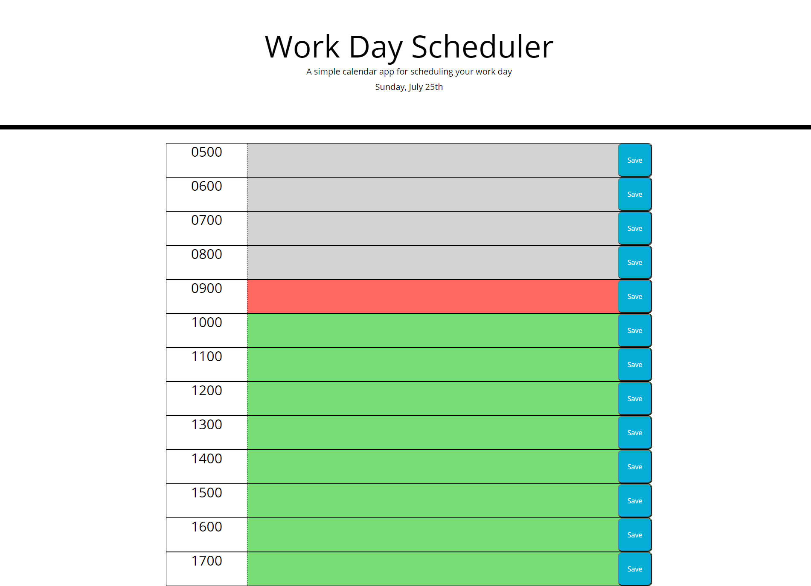

# Workday Scheduler

## Description

A simple workday scheduler built with bootstrap and jQuery that indicates if the hour has passed, is current, or is in the future by color coding them. It allows you to save tasks to it and the data persists on local storage. You can find the websit [here](https://tutor78.github.io/workday-scheduler).

## Use

- Click on a box next to the hour you want to set a task for
- After you have entered text click the save button to save it local storage
- To delete a task you must erase the content and click save again to update local storage

## Preview

## Languages

- HTML
- CSS
- Javascript

## License

This project is licensed under [GNU GPLv3](LICENSE.txt).